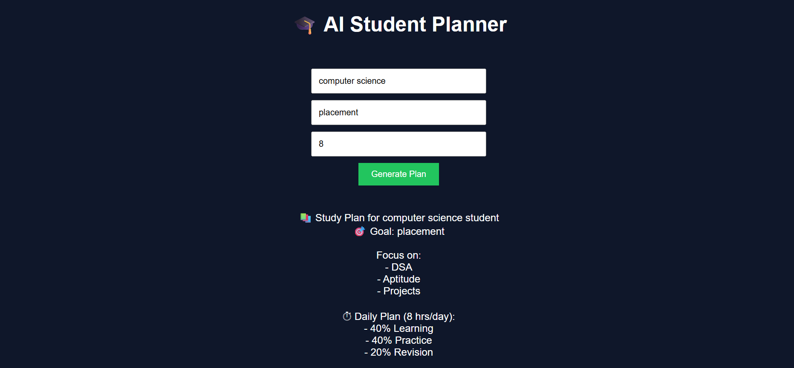

# 🎓 AI Student Planner

## 📌 Overview

The **AI Student Planner** is a web-based application that helps students generate a personalized study plan based on their academic background, career goals, and daily study availability.

This project is developed as part of the **Bring Your Own Project (BYOP)** initiative, focusing on solving a real-world problem using concepts from Artificial Intelligence and Machine Learning.

---

## ❗ Problem Statement

Students often face difficulties in:

* Planning their studies effectively
* Deciding what to focus on
* Managing time efficiently
* Choosing the right learning resources

Due to the lack of structured guidance, students may feel overwhelmed and unproductive.

---

## 💡 Proposed Solution

The AI Student Planner solves this problem by:

* Taking user inputs (branch, goal, study hours)
* Processing them using intelligent logic
* Generating a **structured and personalized study plan**

It acts as a basic AI assistant that guides students in organizing their academic efforts.

---

## 🎯 Objectives

* To simplify study planning for students
* To provide goal-oriented guidance
* To demonstrate practical application of AI concepts
* To build a simple full-stack application

---

## 🚀 Features

* 📚 Personalized study plan generation
* 🎯 Goal-based recommendations (Placement / Higher Studies / Skill Development)
* ⏱ Time allocation strategy (Learning, Practice, Revision)
* 💻 Branch-specific suggestions
* 💡 Recommended learning resources
* 🌐 Simple and user-friendly interface

---

## 🧠 How It Works

1. The user enters:

   * Branch (e.g., Computer Science, Mechanical)
   * Goal (Placement / Higher Studies / Skill Development)
   * Study hours per day

2. The backend processes the input using rule-based logic.

3. Based on the input:

   * Focus areas are determined
   * Time is divided efficiently
   * Resources are suggested

4. A personalized study plan is displayed on the screen.

---

## 🛠 Tech Stack

### Frontend:

* HTML
* CSS
* JavaScript

### Backend:

* Python
* Flask

### Libraries:

* Flask-CORS (for API communication)

---

## 📂 Project Structure

```id="3c9v8m"
student-planner/
│
├── index.html        # User Interface
├── style.css         # Styling
├── script.js         # Frontend logic
├── main.py           # Backend (Flask server)
├── README.md         # Documentation
```

---

## ⚙️ Installation & Setup

### Step 1: Clone Repository

```id="b1b94s"
git clone <your-repo-link>
cd student-planner
```

### Step 2: Install Dependencies

```id="pjc5df"
pip install flask flask-cors
```

### Step 3: Run Backend

```id="kzy6f3"
python main.py
```

### Step 4: Run Frontend

* Open `index.html` in your browser
* OR use Live Server in VS Code

---

## ▶️ Usage

1. Enter your branch
2. Enter your goal
3. Enter available study hours
4. Click **Generate Plan**
5. View your personalized study plan

---

## 📊 Example Output

```id="p3v2sd"
📚 Study Plan for Computer Science student
🎯 Goal: Placement

Focus on:
- Data Structures & Algorithms
- Aptitude
- Projects
- Mock Interviews

⏱ Daily Plan (6 hrs/day):
- 40% Learning
- 40% Practice
- 20% Revision

💻 Recommended for CSE:
- LeetCode
- GeeksforGeeks
- Build coding projects

💡 Suggested Resources:
- YouTube
- Coursera
- LeetCode
- GeeksforGeeks
```

---

## 📸 Screenshots

(Add your screenshot here)

```id="m3n5fj"

```

---

## ⚠️ Limitations

* Uses rule-based logic instead of advanced ML models
* Limited input parameters
* No database or user history
* Basic UI design

---

## 🔮 Future Improvements

* Integrate Machine Learning for smarter recommendations
* Add chatbot-based interaction
* Improve UI/UX design
* Add login and user profile system
* Store and track study plans
* Deploy as a web application

---

## 🧪 Testing

The application was tested with:

* Different branches (CSE, Mechanical, Civil)
* Different goals (Placement, Higher Studies, Skills)
* Different study hours

The system successfully generated relevant and structured outputs.

---

## 📘 Learning Outcomes

Through this project, I learned:

* Basics of full-stack development
* API development using Flask
* Frontend-backend integration
* Applying AI concepts to real-world problems
* Writing structured project documentation

---

## 👨‍💻 Author

**Devansh Dubey**

---

## 📜 License

This project is developed for academic purposes as part of a college assignment.

---

## 🙌 Acknowledgment

This project is inspired by common challenges faced by students in managing their academic workload and planning effectively.
